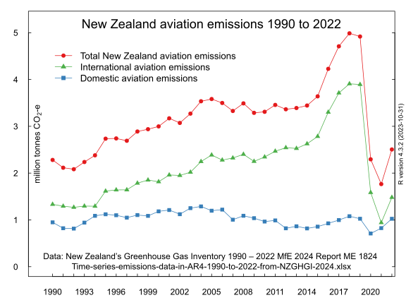

## New Zealand aviation emissions 1990 to 2021

New Zealand's domestic aviation emissions (from domestic flights) are counted and included in the total gross emissions as declared in the annual Greenhouse Gas Inventory compiled by the Ministry for the Environment. 

New Zealand's international aviation emissions (from the arrival and departure of international flights) are counted and **not** included in the total gross emissions as declared in the annual Greenhouse Gas Inventory compiled by the Ministry for the Environment. 

These emissions can be obtained from the [detailed spreadsheet](https://environment.govt.nz/assets/publications/climate-change/Time-series-emissions-data-by-category-presented-in-AR4-Excel-xlsx.xlsx) accompanying [New Zealand’s Greenhouse Gas Inventory 1990 – 2021 MfE 2023 Report ME 1750](https://environment.govt.nz/publications/new-zealands-greenhouse-gas-inventory-1990-2021/)

Here is the chart of actual final allocation of emission units compared to the estimated actual steel emissions from the Greenhouse Gas Inventory.

